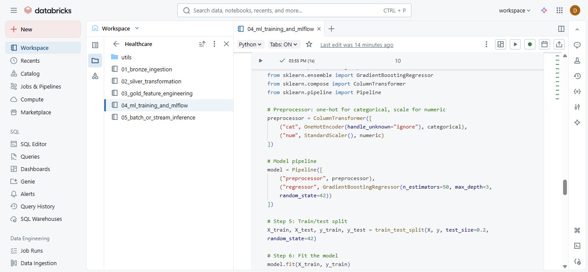
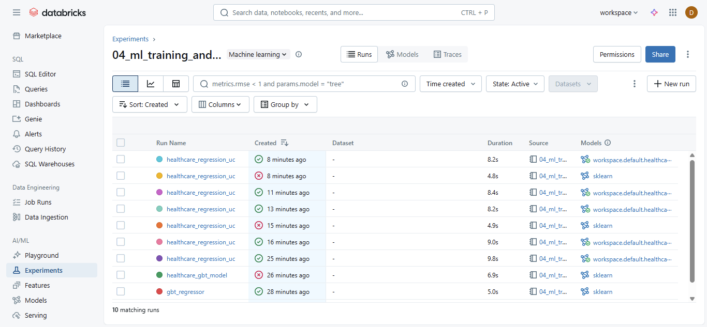
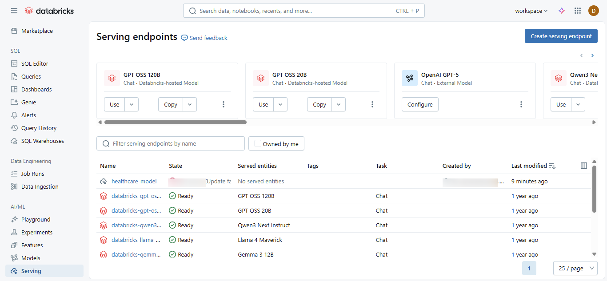
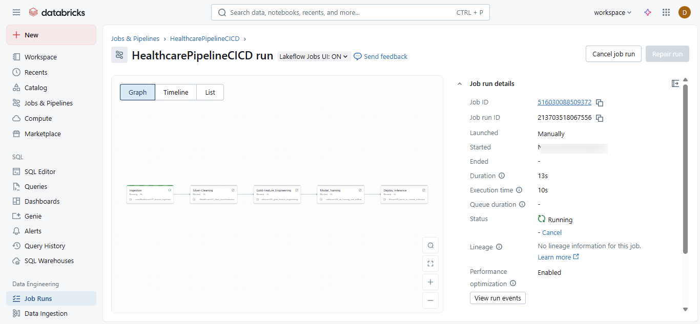

# Databricks ML Model Registration to Unity Catalog using MLflow (Automated CI/CD)

This project demonstrates how to train a machine learning regression model in Databricks, log and register it with MLflow, and manage it within the Unity Catalog Model Registry using aliases instead of legacy stages. End-to-end ML pipeline built on Databricks for the Healthcare domain, integrating MLflow tracking, model versioning &amp; deployment under Unity Catalog.  It automates the entire MLOps lifecycle — from data ingestion and transformation (Bronze → Silver → Gold layers) to model training, evaluation, registration, and serving, with CI/CD best practices.

## Project Overview
We use a Healthcare Payments dataset stored in the Gold Layer of the Databricks Lakehouse.

The workflow covers:
1. Data preprocessing with PySpark
2. Model training with scikit-learn
3. Experiment tracking & model registration using MLflow
4. Model aliasing (staging/production) within Unity Catalog
5. Optional: Model serving on Databricks

## Architecture
```java

Bronze Layer (Raw Data)
        │
        ▼
Silver Layer (Cleaned Data)
        │
        ▼
Gold Layer (Feature-Ready Data)
        │
        ▼
ML Training Notebook
(PySpark + scikit-learn)
        │
        ▼
MLflow Logging & Tracking
        │
        ▼
Unity Catalog Model Registry
        │
        ▼
Databricks Model Serving Endpoint
        │
        ▼
CI/CD Automated Deployment

```

## Prerequisites
- Databricks workspace with Unity Catalog enabled
- Permissions:
  ```sql
  GRANT CREATE, WRITE ON SCHEMA main.healthcare_uc TO current_user;
  ```
- Cluster with `pyspark`, `mlflow`, `scikit-learn`

## Steps

### Training


### Mlflow register (best model)


### Experimenting


### Serving-endpoints


### Job-Triggers



### 1️⃣ Load and Prepare Data
```python
from pyspark.sql import SparkSession
spark = SparkSession.builder.getOrCreate()
df = spark.table("main.healthcare_uc.gold_payments")
# Data preprocessing steps
```

### 2️⃣ Train Model (RandomForestRegressor) 
#### note : if dataset size > 1 to 100GB use Pyspark MLib ( <1GB Scikit-learn / Pandas)
#### above 100 GB datasets = PySpark MLlib + distributed training (XGBoost, TensorFlow, Horovod)
```python
from sklearn.model_selection import train_test_split
from sklearn.ensemble import RandomForestRegressor

X = df.drop('target_column').toPandas()
y = df.select('target_column').toPandas()
X_train, X_test, y_train, y_test = train_test_split(X, y, test_size=0.2)
model = RandomForestRegressor()
model.fit(X_train, y_train)
```

### 3️⃣ Log & Register Model to Unity Catalog
```python
import mlflow
import mlflow.sklearn

with mlflow.start_run() as run:
    mlflow.sklearn.log_model(model, "healthcare_model", registered_model_name="main.healthcare_uc.healthcare_model")
```

### 4️⃣ Assign Alias
```python
from mlflow.tracking import MlflowClient
client = MlflowClient()
client.set_registered_model_alias(name="main.healthcare_uc.healthcare_model", alias="staging", version=1)
```

### 5️⃣ Load Model by Alias
```python
staging_model = mlflow.pyfunc.load_model("models:/main.healthcare_uc.healthcare_model/staging")
```

### 6️⃣ Serve the Model
- Go to **Databricks UI → Model Serving**
- Select model and alias
- Deploy endpoint

## Troubleshooting
- **MODEL_SIZE_OVERFLOW_EXCEPTION**: Reduce model size
- **ML_CACHE_SIZE_OVERFLOW_EXCEPTION**: Delete cached models
- **transition_model_version_stage unsupported**: Use aliases instead

## Summary
- ✅ Trained & tracked ML model
- ✅ Logged with MLflow and signature
- ✅ Registered to Unity Catalog
- ✅ Assigned alias for staging
- ✅ Served via Databricks Model Serving (CI/CD automated)

